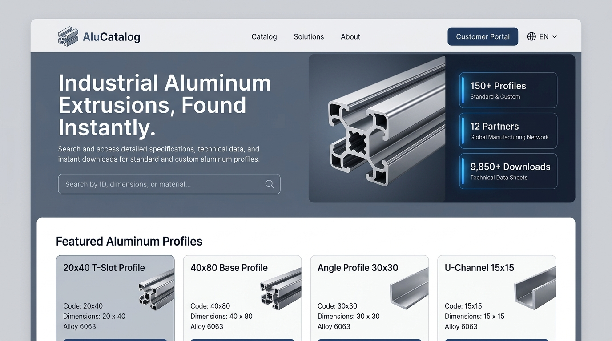
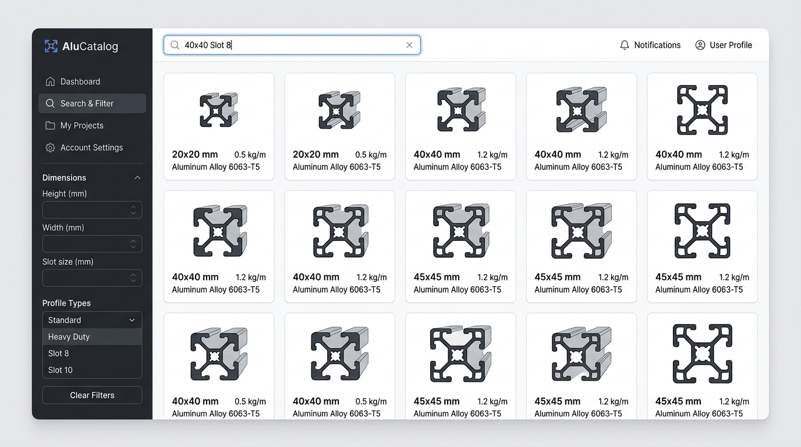
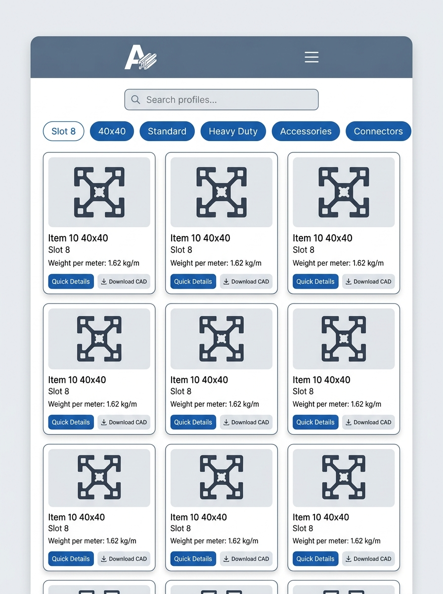
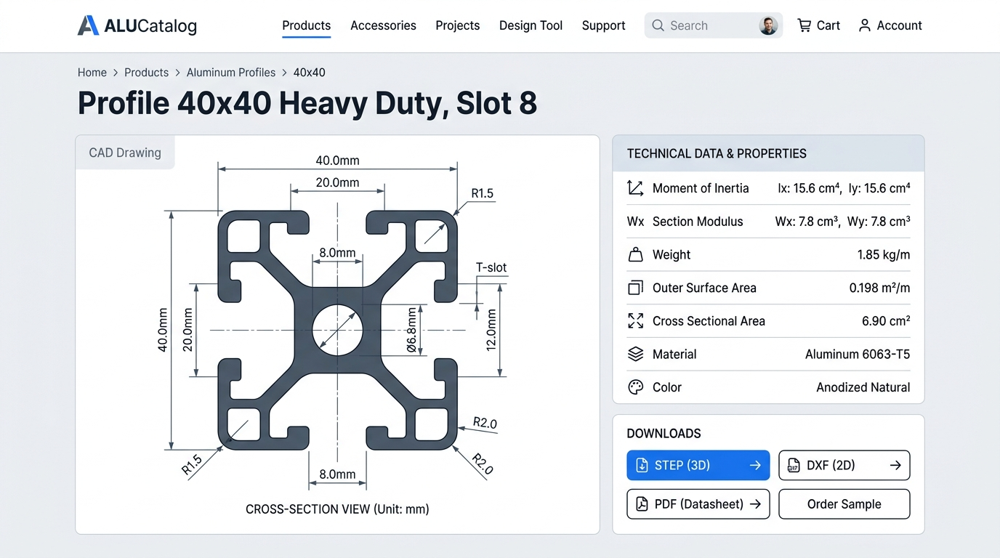
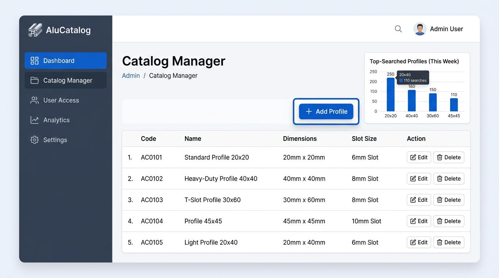
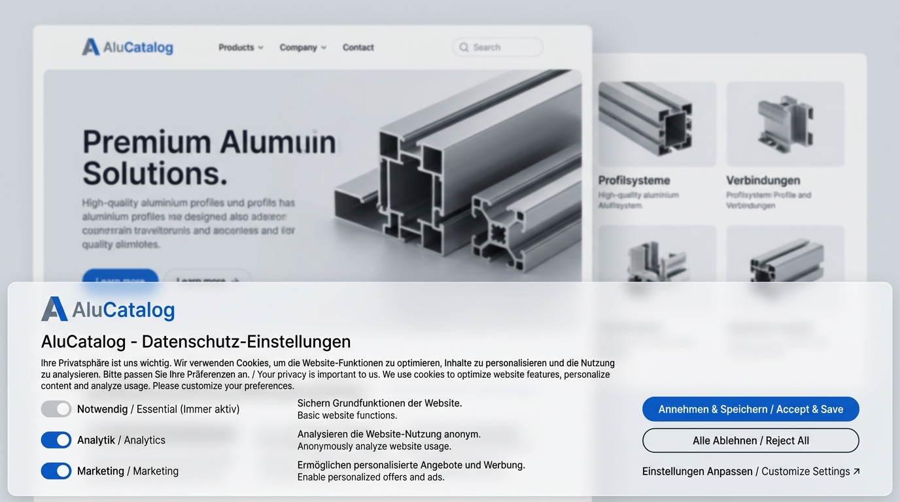

  <h1>Project Proposal & Business Plan</h1>
  <h3>Aluprofile Search & Catalog System (Visual & Analytics Edition)</h3>

 

**Date:** July 21, 2026  
**Prepared By:** Ashiqur Rahman  
**Prepared For:** Oliver Kascha  
**Target Market:** Europe (DSGVO / GDPR Compliant)

## 1. Executive Summary
The objective of this project is to architect and deliver a high-performance, secure, and visually premium digital catalog platform for your business. The platform will enable your customers to seamlessly search, filter, and download CAD drawings of your aluminum profiles, while providing you with an administrative dashboard containing advanced search and download analytics.

**The European Market Advantage:** 
In the European market, consumer expectations for digital platforms are characterized by requirements for instant load times, premium aesthetics, and strict adherence to data privacy regulations. Local agencies typically quote between **€10,000 and €20,000** for a custom platform of this technical caliber, alongside substantial ongoing fees. 

Operating as an independent technical expert, I bypass agency overhead costs. Consequently, I can deliver a tailored, "Enterprise-Grade" software solution—optimized for the European market, visual elegance, and strict DSGVO privacy laws—at a highly competitive investment level.

---

## 2. Platform Visual Concept & Mockups

To ensure we are aligned on the user interface before construction, here is the design direction for the core views of your application:

### A. The Landing Page (First Entry Page)
When a user first visits your website, they are greeted by a clean, modern, and high-impact landing page that builds instant authority.

* **Hero Banner:** A bold headline ("Industrial Aluminum Extrusions, Found Instantly") introducing your business, paired with a modern floating 3D render of an aluminum profile.
* **Instant Search:** A prominent search bar right in the hero section to immediately capture user queries.
* **Trust Badges & Statistics:** Quick visual counters displaying key metrics (e.g., 150+ Profiles, 12 Partners, 9,850+ CAD Downloads).
* **Featured Profiles Grid:** Displaying standard profiles (like T-slot, Base, Angle, U-channel) directly on the front page to invite immediate interaction.

### B. Customer Catalog & Advanced Search
If users want to search deeply or filter our inventory, they transition to a dedicated search workspace.

* **Sidebar Filters:** Instant filtering by Height, Width, Slot size, and profile types (e.g. Standard vs. Heavy-Duty).
* **Grid Layout:** Cards showing clear profile cross-section outlines, weight, and material classification.
* **Smart Search:** Active auto-suggestions as they type.

### C. Mobile Responsive Catalog View
On-site engineers and buyers frequently access catalogs from smartphones and tablets. The site is optimized for mobile touchscreens.

* **Responsive Layout:** Grid cards stack neatly in a single column for comfortable mobile vertical scrolling.
* **Filter Pills:** Horizontal scrollable chips ("Slot 8", "40x40", "Standard") allow quick filtering with a single tap.
* **Compact Actions:** Direct taps for details or instant file downloads.

### D. Profile Technical Detail Page
Clicking any profile opens an interactive datasheet, allowing engineers to check dimensions and download CAD files.

* **CAD Cross-Section Schematic:** A detailed engineering drawing showing exact measurements, slot depth, and inner bore.
* **Technical Properties:** Section properties, Moment of Inertia, Section Modulus, weight (kg/m), and outer surface area.
* **Download Center:** Direct file downloads for **STEP (3D)**, **DXF (2D)**, and **PDF** datasheets.

### E. Admin Dashboard & Catalog Manager
A secure panel for you and your staff to manage the database and review customer engagement.

* **Record Table:** List, edit, or delete existing profiles, suppliers, and applications.
* **Analytics Widget:** A dashboard chart displaying visitor trends and top-searched profiles.

### F. DSGVO / GDPR Cookie Consent Banner
Strictly compliant with European data regulations, the platform implements a dual-language opt-in banner.

* **Granular Options:** Customers can opt in/out of Analytics and Marketing trackers separately (as legally required).
* **Bilingual UI:** Clean text in both German and English.
* **Glassmorphic Styling:** A modern, semi-transparent banner that matches the premium aesthetic without cluttering the interface.

---

## 3. Platform Architecture & Core Features

Your digital platform will be engineered using modern, robust web technologies, structured into three core pillars:

*   **Premium Customer Frontend (Web Client):** A responsive, premium user interface designed to establish immediate trust with your European clientele. 
    *   *Features:* Advanced search and filtering capabilities (by dimensions, profile type, etc.), mobile-optimized catalog viewing, and instantaneous page loading.
*   **Sophisticated Catalog Counter & Analytics Engine:** 
    *   *Features:* Instead of a basic hit counter, we will build a custom tracker that logs **Unique Visitors** (fully DSGVO-compliant), **Search Queries** (capturing what sizes your customers look for), and **CAD File Downloads** (STEP/DXF/PDF click events).
*   **Administrative Dashboard (Catalog Manager):** A secure, password-protected admin area.
    *   *Features:* Add/edit/delete profiles, manage suppliers, adjust search categories, and view graphical analytics charts.
*   **Analytics & DSGVO Compliance:** 
    *   *Features:* Integration of Google Analytics 4 (GA4) alongside a customized opt-in Cookie Consent Banner ensuring absolute compliance with European DSGVO laws.

---

## 4. Project Phases & Timeline

The development lifecycle is divided into five distinct phases:

| Phase | Description | Estimated Duration |
| :--- | :--- | :--- |
| **Phase 1: Planning & Visual Blueprint** | UX/UI design blueprint, brand color integration, and establishing the database logs schema. | Approx. 10-12 Hours (2-3 Days) |
| **Phase 2: Core Engineering & Database** | Development of the public frontend, backend database API, file upload systems, and secure admin auth. | Approx. 45-50 Hours (10-14 Days) |
| **Phase 3: Redesign & Analytics Counter** | Implementing the premium layout overhaul, tracking APIs (unique views, search keywords, CAD downloads), and dashboard graphs. | Approx. 28-30 Hours (5-7 Days) |
| **Phase 4: Legal Tracking & Privacy (DSGVO)** | GA4 integration and implementation of the opt-in Cookie Consent system for European users. | Approx. 10 Hours (2 Days) |
| **Phase 5: Quality Assurance & Launch** | Cross-device testing (iOS, Android, macOS, Windows). Domain setup and live production deployment. | Approx. 10 Hours (2 Days) |

**Total Estimated Project Timeline:** 4 to 5 Weeks from project initiation.

---

## 5. Investment Breakdown

*My professional development rate is €30/hour. Below is a fixed-price guarantee. You will not incur unexpected development costs for the agreed scope.*

| Phase | Description | Fixed Investment (Netto) |
| :--- | :--- | :--- |
| **Phase 1** | Planning & Visual Blueprint | €350 |
| **Phase 2** | Core Engineering & Database | €1,350 |
| **Phase 3** | Redesign & Analytics Counter | €850 |
| **Phase 4** | Legal Tracking & Privacy (DSGVO) | €300 |
| **Phase 5** | QA Testing & Live Launch | €300 |
| **Total** | **Fixed Project Investment** | **€3,150** |

**Payment Milestones:**
*   **50% Deposit (€1,575)** to secure development time and commence Phase 1.
*   **50% Final Payment (€1,575)** due only upon 100% completion, testing, and live deployment.

---

## 6. Hosting, Data Ownership & Security
*   **Data Residency:** To strictly comply with European (GDPR/DSGVO) regulations, the platform and its database will be hosted on secure servers located exclusively within the European Union (typically ~€10-€20/month, billed directly to you by the provider).
*   **Intellectual Property:** Upon final payment, your company assumes full ownership rights to the final application code and its database.

---

## 7. Post-Launch Maintenance & Lifespan Support
To keep things completely transparent and flexible, ongoing maintenance and updates are billed on a simple hourly basis. This eliminates complex monthly tiers and ensures you only pay for the exact work you request.

*   **Hourly Support Rate:** **€35/hour** (billed in 30-minute increments).
    *   *What this covers:* Any future catalog updates, adding new aluminum profiles, design enhancements, styling adjustments, or new features.
*   **Optional "Security & Keep-Alive" Retainer:** **€95 / month** (Optional)
    *   *What this covers:* Automatic weekly database backups, critical security patch application, and 24/7 server monitoring to keep the platform online and secure.
*   **Complimentary Warranty:** Remember that the first **30 days post-launch** are fully covered under the complimentary Bug Warranty (Section 8) at no charge.

---

## 8. Included Guarantees & Training (Complimentary)
1.  **30-Day Bug Warranty:** For 30 days post-launch, any technical anomalies related to the agreed scope will be resolved immediately without charge.
2.  **Handover & Training Session:** A 1-hour dedicated video consultation to train your team on managing the catalog and reading analytics.

---

**Next Steps:**
If this updated proposal aligns with your business objectives, please confirm via email ([ashiqurrhaman90@gmail.com]). I will generate the deposit invoice and we will initiate Phase 1.
